# 先看一个例子

``` JavaScript
(function test() {
    setTimeout(function() { console.log(1) }, 0);
    new Promise(function(resolve) {
        console.log(2);
        for (var i = 0; i < 10000; i++) {
            i == 9999 && resolve();
        }
        console.log(3);
    }).then(function() {
        console.log(4);
        new Promise(function(resolve) {
            setTimeout(function() {
                resolve();
                console.log(5);
            }, 0);
            console.log(6);
        }).then(function() {
            console.log(7);
        });
    });
    console.log(8);
    return 9;
})()
```

在这个例子中，有setTimeout、Promise、回调函数以及函数返回值等等，那么控制台当中会以一个什么顺序打印这些数字呢？现在不知道答案很正常，不妨先思考一下，带着问题看下面的内容。

# 阻塞与线程

**在搞清楚JavaScript运行机制之前，我们需要了解什么是阻塞，什么是线程。**

大学我们学《操作系统》这门课程，里面详细的讲述了进程、线程的概念，以及操作系统进程调度相关的内容，线程在执行中如果遇到磁盘读写或者网络通信(统称为I/O操作)，通常要耗费较长的时间，这是操作系统会剥夺这个线程的CPU控制权，使其暂停执行，同时将资源让给其他的工作线程，这种线程的调度方式称为***阻塞***。当I/O操作结束，操作系统将这个线程的阻塞状态解除，恢复其对CPU的控制权，令其继续执行。这种I/O模式就是我们通常说的***同步式I/O***。

相应地，***异步式I/O***是针对上述的I/O操作，不采用阻塞模式，当线程遇到I/O操作时，不会以阻塞的方式等待I/O操作的结束，而只是将I/O操作请求发送给操作系统，然后继续执行下一条语句。当操作系统完成I/O操作，以事件的形式通知执行I/O操作的线程，线程会在特定的时间处理这个事件，可见使用异步式I/O，**单线程即可胜任**。这里提到了异步式I/O的一个重要的概念：**事件**！这也是我们这篇文章要讨论的核心。

**接下来我们看看异步式I/O和同步式I/O到底有什么区别？**

我们知道，一个线程同时只能处理一项任务，并且I/O操作往往比CPU计算要耗时得多，所以在同步式I/O模式下，当I/O操作执行时，线程被阻塞，CPU处于空闲的状态，如果要提高CPU的利用率，必须通过多线程，一个线程因为同步式I/O被阻塞了，还有其它线程在工作，多线程可以让CPU资源不被阻塞中的线程浪费，这也是众多多线程语言采用的模式。既然**多线程+同步式I/O**也能提高CPU的吞吐量，我们为什么还要讨论**异步式I/O+事件循环**的模式呢？在回答这个问题之前，我们先看两张图：

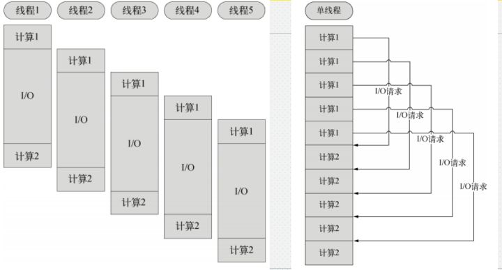左：多线程同步式I/O 右：单线程异步式I/O

上图分别是同步式I/O+多线程和异步式I/O+事件循环的示意图。假设我们有一个任务，可以分为两个计算部分和一个I/O部分。现在我们要完成5项这个任务。

同步式I/O+多线程模式如左图所示，5项任务分别由5个线程来完成，从CPU的维度来看，CPU

先分配给线程1进行计算1
1. -> 分配给线程2进行计算1
2. -> 分配给线程3进行计算1
3. -> 分配给线程4进行计算1
4. -> 分配给线程5进行计算1

至此5个任务的计算1都已完成，然后任务1的I/O操作结束，CPU又

分配给线程1进行计算2
1. -> 分配给线程2进行计算2
2. -> 分配给线程3进行计算2
3. -> 分配给线程4进行计算2
4. -> 分配给线程5进行计算2 。

最后完成5项任务。

再看右图，CPU可以一直在一个线程上完成所有计算，执行的顺序和效果和多线程并无差别，可见，单线程事件驱动的异步式 I/O 比传统的多线程同步式I/O，少了多线程的开销，对于操作系统来说，创建一个线程的代价是非常昂贵的：需要给它分配内存、列入调度、在线程切换时还要执行内存换页、清空CPU缓存等等。说到这里，异步式I/O+事件循环模式的好处不言而喻了，如下列表，简单介绍了两种模式的特点。

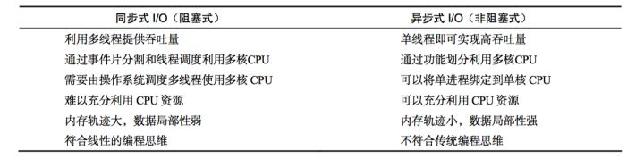
同步式I/O和异步式I/O的特点

当然，异步式I/O+事件循环模式也不是没有它的缺点，因为编码都需要是异步的，不符合人们一般的程序设计思维，容易让控制流变得晦涩难懂，给编码和调试都带来不小的困难。前端工程师一直被异步的回调和函数嵌套所困扰，不过在社区以及大牛的努力之下，越来越多的解决方案以及标准逐步完成，例如ES6中的Promise、ES2017中的async/await等等，网上有很多[详细介绍的资料](http://es6.ruanyifeng.com/#docs/async)，我们不展开介绍。

```JavaScript
//异步回调嵌套
$.get('url', function(data) {
    $.get('url1', data,
        function(data1) {
            $.get('url2', data1, function(data2) {
                console.log(data2);
            }, 'json');
        }, 'json');
}, 'json');
//用async和await的实现
var asyncGetdata = async function() {
    var data = await $.get('url');
    var data1 = await $.get('url1', data);
    var data2 = await $.get('url2', data1);
    console.log(data2);
};
asyncGetdata();
```

# JavaScript运行机制：消息队列和事件循环


我们常说“JavaScript是一门单线程的语言”，所以JavaScript是采用异步式I/O+事件循环模式的。但这里我要澄清一下，所谓的单线程，是指在JS引擎中负责解释和执行JavaScript代码的线程只有一个。我们称它**主线程**。

但是实际上还存在其他的线程。例如：处理AJAX请求的线程、处理DOM事件的线程、定时器线程、读写文件的线程(例如在Node.js中)等等。我们称它们**工作线程**。

单线程也就意味着，所有任务需要排队，前一个任务结束，才会执行后一个任务。如果前一个任务耗时很长，后一个任务就不得不一直等着。如果排队是因为计算量大，CPU忙不过来，倒也算了，但是很多时候CPU是闲着的，因为I/O很慢，不得不等着结果出来，再往下执行。

好在我们上文中提到，采用异步式I/O+事件循环模式时，当耗时的I/O的操作结束后，会以事件的形式通知主线程，这样就可以避免阻塞，那么这个**通知机制**是怎样实现的呢？答案是利用消息队列和事件循环。

## 消息队列

当采用异步式I/O+事件循环后，所有任务可以分成两种，一种是同步任务，另一种是异步任务（*此处为了理解方便，先只分为同步任务和异步任务，后面我们会细分为宏任务、微任务、正常任务*）。同步任务指的是，在主线程上排队执行的任务，只有前一个任务执行完毕，才能执行后一个任务；异步任务指的是，暂时不进入主线程而是进入消息队列的任务，只有主线程的同步任务全部结束后该任务才会进入主线程执行。用一句话概括就是：

> **工作线程将消息放到消息队列，主线程通过事件循环去取消息。**

1. 所有同步任务都在主线程上执行，形成一个执行栈（execution context stack）。
2. 主线程之外，还存在一个消息队列。只要异步任务有了运行结果，就在消息队列之中放置一个事件。
3. 一旦"执行栈"中的所有同步任务执行完毕，系统就会读取消息队列，看看里面有哪些事件。那些对应的异步任务结束等待状态，进入执行栈，开始执行。
4. 主线程只会做一件事情，就是从消息队列里面取消息、执行消息，再取消息、再执行，不断重复上面的第三步。

用图表示这个过程就是：

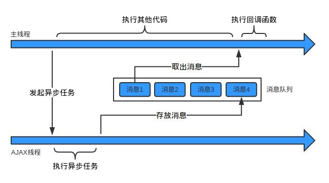

## 事件循环

上文提到主线程从消息队列中读取消息，这个过程是循环不断的。当消息队列为空时，就会等待直到消息队列变成非空。而且主线程只有在将当前的消息执行完成后，才会去取下一个消息。**这种机制就叫做事件循环机制，取一个消息并执行的过程叫做一次事件循环。**

可见异步过程的回调函数，一定不在当前这一轮事件循环中执行，可不一定会在下一轮事件循环中进行(取决于异步过程结束往消息队列添加消息时，队列中是否有其它消息)。

为了更好地理解事件循环，请看下图:

> 转引自Philip Roberts的演讲《Help, I'm stuck in an event-loop》


上图中，主线程运行的时候，产生堆（heap）和栈（stack），当栈中的代码调用DOM事件绑定、ajax请求、以及定时器等外部API时就会交给浏览器内核的其他模块，即上文中提到的**工作线程**进行处理。

> webkit内核在Javasctipt执行引擎之外，有一个重要的模块是webcore模块。对于图中WebAPIs提到的三种API，webcore分别提供了DOM Binding、network、timer模块来处理底层实现

等这些工作线程处理完成后，就会往消息队列里放置onClick、onLoad、onDone等相应的事件。只要调用栈中的代码执行完毕，主线程就会依次去读取消息队列，并执行那些事件所对应的回调函数。

# 从setTimeout看消息队列与事件循环

下面依然是用Philip Roberts的演讲中的一个栗子来说明事件循环机制究竟是怎么执行setTimeout的。

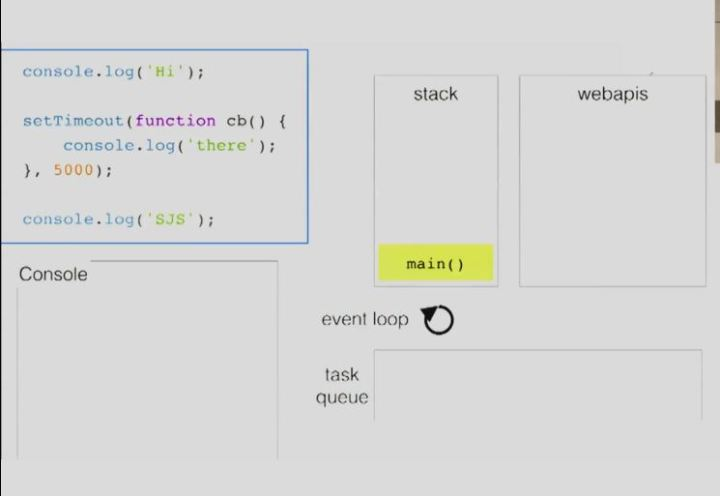

首先main()函数的执行上下文入栈，开始执行同步任务。

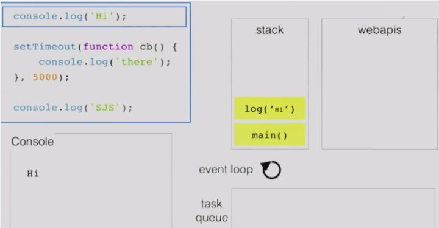

遇到console.log('Hi')，此时log('Hi')入栈，console.log方法只是一个webkit内核支持的普通的方法，它是同步任务，所以log('Hi')方法立即出栈被引擎执行。此时输出'Hi'。

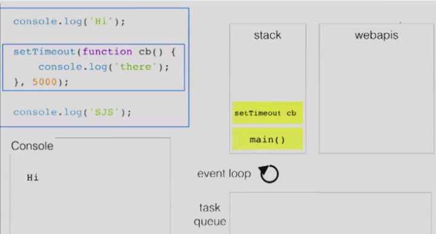

当遇到setTimeout的时候，将setTimeout(callback,5000)添加到执行栈。

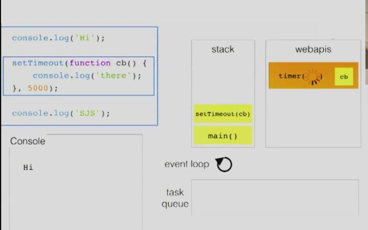

调用栈发现setTimeout是之前提到的事件循环模型中WebAPIs中的方法，因此将其出栈执行后将延时执行的函数交给浏览器的timer模块进行处理。

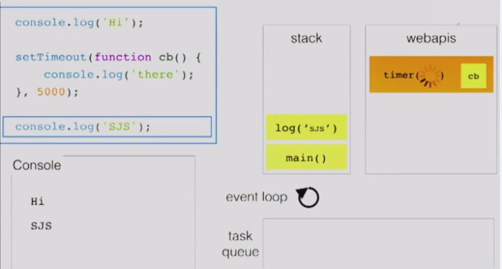

timer模块去处理延时执行的函数，此时执行引擎接着立即继续往下处理后面代码，于是将log('SJS')加入执行栈，接下来log('SJS')出栈执行，输出'SJS'。而执行引擎在执行完console.log('SJS')后，程序处理完毕，main()方法也出栈。此时一项同步任务全部完成。

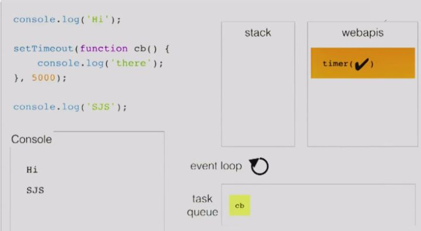

当timer模块中延时方法规定的时间到了之后就将其放入到任务队列之中，此时调用栈中的task已经全部执行完毕，主线程处于空闲状态。

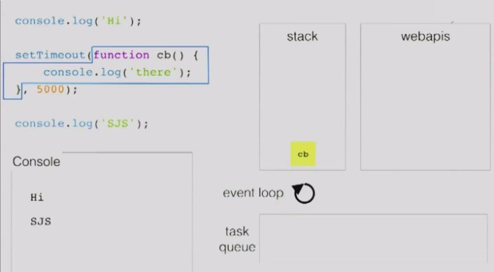

于是主线程在下一次事件轮询时，发现刚刚放入消息队列的cb事件，便将cb入栈。

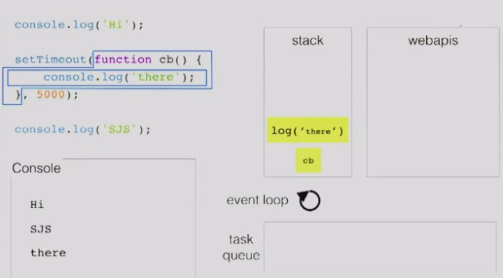

接着执行cb里面的代码，将log('there')入栈然后出栈执行，输出’there’，等到log执行结束之后cb函数运行完毕，cb接着出栈。之后主线程处于空闲状态，一直不停地轮询消息队列，看看没有要执行的事件。

# 宏任务(macro-task)、微任务(micro-task)、正常任务(task)

还记得我在最开始抛出来的那个例子吗？我们现在再来看一看

```JavaScript
(function test() {
    setTimeout(function() { console.log(1) }, 0);
    new Promise(function(resolve) {
        console.log(2);
        for (var i = 0; i < 10000; i++) {
            i == 9999 && resolve();
        }
        console.log(3);
    }).then(function() {
        console.log(4);
        new Promise(function(resolve) {
            setTimeout(function() {
                resolve();
                console.log(5);
            }, 0);
            console.log(6);
        }).then(function() {
            console.log(7);
        });
    });
    console.log(8);
    return 9;
})()
```

通过上面的介绍，我们已经知道，8、9、1这三个的顺序，但是Promise内的代码是按照什么顺序执行的呢？这里我们要开始介绍macro-task、micro-task和task概念。

**其实上文中提到到同步任务和异步任务，分别对应这里介绍的task和macro-task**。上文中提到消息队列其实就是macro-task队列，task其实就是执行栈中的同步任务。那么micro-task是什么呢？

刚才我介绍过事件循环机制，我们知道，当一个任务执行完后，主线程会从macro-task队列(之前说的消息队列)中取出事件，开始下一轮的任务执行。而某些情况下，我们需要某些任务要在本轮事件循环结束前执行，于是，除了macro-task队列外，其实还有一个micro-task队列，里面存放**本轮正常任务执行中添加的需要在本轮事件循环结束前、在本轮事件循环所有task结束后**执行的任务。

我们要区分任务执行的顺序，一定要搞清楚它是什么类型的任务。setTimeout上文已经讨论得很清楚了，它的回调函数是一个macro-task，会被放到macro-task队列。而对于Promise，**被构造时传入的回调函数，是会立即执行的，它是task，会出现在调用栈中**。而Promise实例的**then方法中的回调函数是micro-task，会在该Promise实例的状态改变时(resolve)被放进micro-task队列**。

> 关于Promise的用法本文不作展开，请自己去学习[阮老师的教程](http://es6.ruanyifeng.com/#docs/promise)

**macro-task**: setTimeout、setInterval、setImmediate、I/O, UI rendering等

**micro-task**: process.nextTick、Promises.then、Object.observe等

常见的macro-task和micro-task如上所示，其中setImmediate和process.nextTick是NodeJs里的API，浏览器里并没有，这里只是列举一下。

总之，事件循环的顺序是从script开始第一次循环，随后全局上下文进入函数调用栈

1. **碰到macro-task就将其交给处理它的模块处理完之后将回调函数放进macro-task的队列之中**
2. **碰到micro-task也是将其回调函数放进micro-task的队列之中**
3. **直到函数调用栈清空只剩全局执行上下文，然后开始执行所有的micro-task，在执行micro-task时如果再碰到micro-task，会将该micro-task继续添加到micro-task队列，当所有可执行的micro-task执行完毕之后，执行栈结束并返回(return)**
4. **循环再次执行macro-task队列中的一个任务，执行完之后再执行所有的micro-task，就这样一直循环**

增加micro-task和micro-task队列的概念后，用图表示这个过程就是：

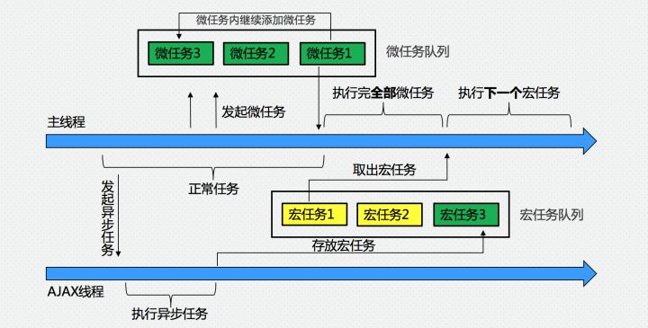
macro-task和micro-task任务及其队列

```JavaScript
(function test() {
    setTimeout(function() { console.log(1) }, 0); //回调会被添加到macro-task队列
    new Promise(function(resolve) {
        console.log(2);
        for (var i = 0; i < 10000; i++) {
            i == 9999 && resolve();
        }
        console.log(3);
    }).then(function() { //回调会在resolve后，添加到micro-task队列
        console.log(4);
        new Promise(function(resolve) {
            setTimeout(function() { //回调会被添加到macro-task队列
                resolve();
                console.log(5);
            }, 0);
            console.log(6);
        }).then(function() {
            console.log(7); //回调会在resolve后，添加到micro-task队列
        });
    });
    console.log(8);
    return 9;
})()
//控制台打印的结果如下：
//2
//3
//8
//4
//6
//9
//1
//5
//7
```

参考文章
[JavaScript 运行机制详解：再谈Event Loop](http://www.ruanyifeng.com/blog/2014/10/event-loop.html)
[定时器](http://javascript.ruanyifeng.com/advanced/timer.html)
[从setTimeout说事件循环](http://www.alloyteam.com/2015/10/turning-to-javascript-series-from-settimeout-said-the-event-loop-model/)
[深入浅出Javascript事件循环机制(上)](https://zhuanlan.zhihu.com/p/26229293)
[深入浅出JavaScript事件循环机制(下)](https://zhuanlan.zhihu.com/p/26238030)
[JavaScript：彻底理解同步、异步和事件循环(Event Loop)](https://segmentfault.com/a/1190000004322358)
