## 利用charles修改报文的功能调试代码
Charles是一款抓包工具，除了最常使用到的抓取请求数据包功能以外，还有很强大的功能，例如：修改请求的或者返回的报文，模拟网络环境，给服务器做简单的压测等等。
### 通过Map映射的方式修改报文
映射修改报文的方式有两种，本地映射(Map Local)和远程映射(Map Remote).
##### Map Local 本地映射
理解上的意思就是改变映射的方式然后让请求去读取放在本地的文件并返回。

基本的操作步骤： 

>选中一条想要映射的网络请求 => 右键 => Save Response保存到本地
>再次选中这个请求 => 右键 => Map Local => 进入设置页面选择刚刚保存的响应文件

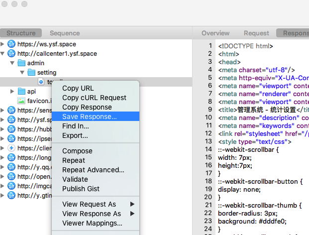

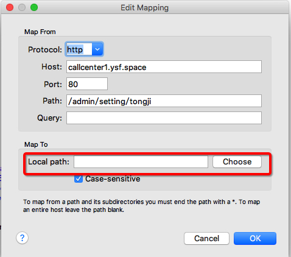

然后每次请求这个请求的时候都会自动请求到本地的文件。我们可以在本地对文件进行任意的修改。

##### Map Remote 远程映射
远程映射是通过修改请求对应的host上的文件来实现
修改报文。
> 选中一个请求 => 右键 => Map Remote

进入设置页面，配置远程的host地址，协议和本地映射类似。

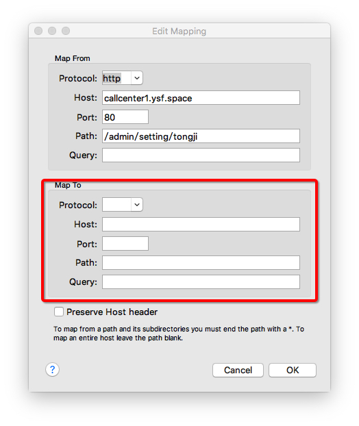

### 通过断点修改
Charles允许我们可以像在Chrome devTools当中对其中的特定请求打断点，使请求暂时中断，在此期间可以进行一些对报文修改的操作。

首先，要打开Charles的断点模式，

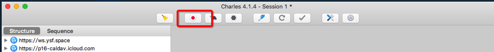

然后选中所要打断点的请求 => 右键 => BreakPoints，下一次再次请求这个请求的时候，Charles就会中断。
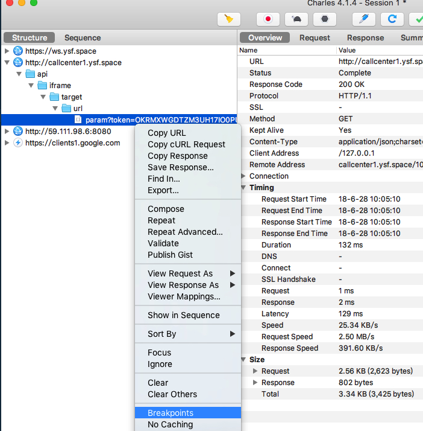

然后点击Edit Response，可以对返回的报文进行自定义的修改。

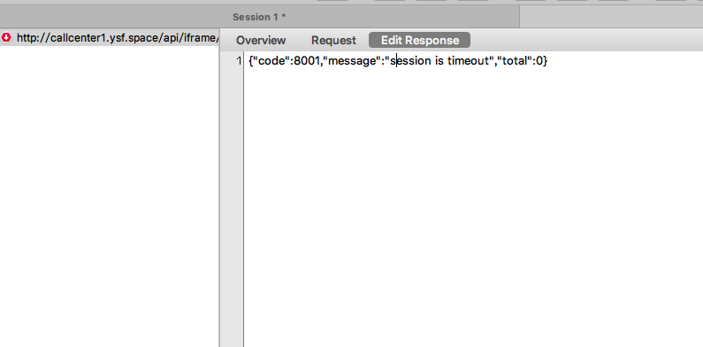

### 用于调试

有时候问题并不一定就发生在本地的开发环境，在线上可以通过修改返回的报文在代码中临时增加一些日志log，来判断代码运行逻辑的正确性。

#### 七鱼线上调试

经常会遇到在线上帮客户定位问题的场景，七鱼线上环境js代码的打包有两种情况，第一种单独打成像core.js,kefu.index.js,robot.js这样的外联js文件，另一种是打包在FTl中的js文件，一般都是可以通过搜索有标识的函数名定位到可能出问题的代码片段，如果代码片段在外联的js文件中，那么就直接可以用chrome自带的format功能将压缩后的代码展开，在chrome devTools中直接通过断点来调试。

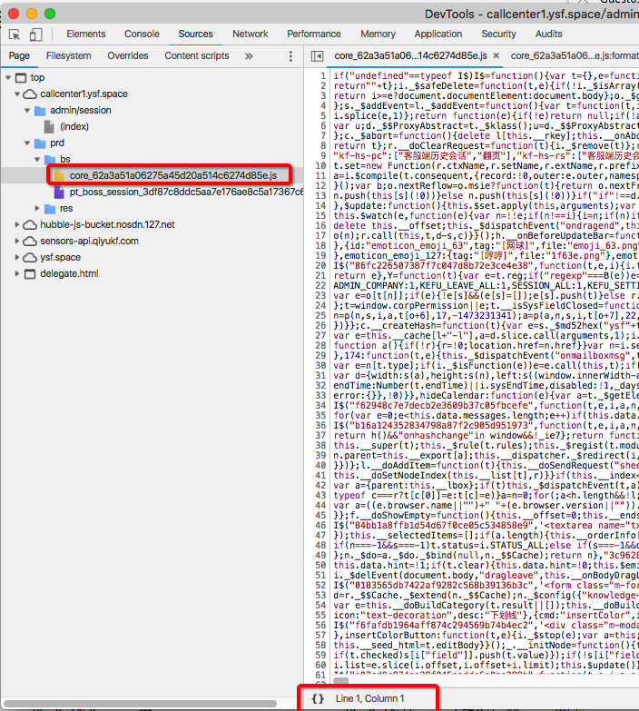

如果问题代码片段打包在FTL文件中，可以发现打在FTL中的代码就算点击{}格式化之后也是无济于事的，断点打不到，也不能修改，调试遇到了很大的麻烦。

chrome引擎在执行这些js代码的时候会解析生成VM Script，而且在VM Script中是可以进行断点调试的。

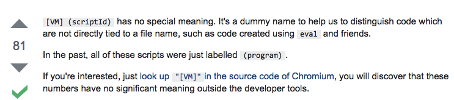

现在的问题就变成了如何找到对应的FTL中代码片段对应的vm脚本，现在我了解的比较好用的方法分两种，一种是FTL代码中如果有一些浏览器可以捕获的行为，例如发送了一些请求，操作了一些dom，打了一些console日志，可以直接在chrome点击行为对应的源文件进入到vm脚本的页面进行打断点调试。

在network面板找到其中一段vm脚本：
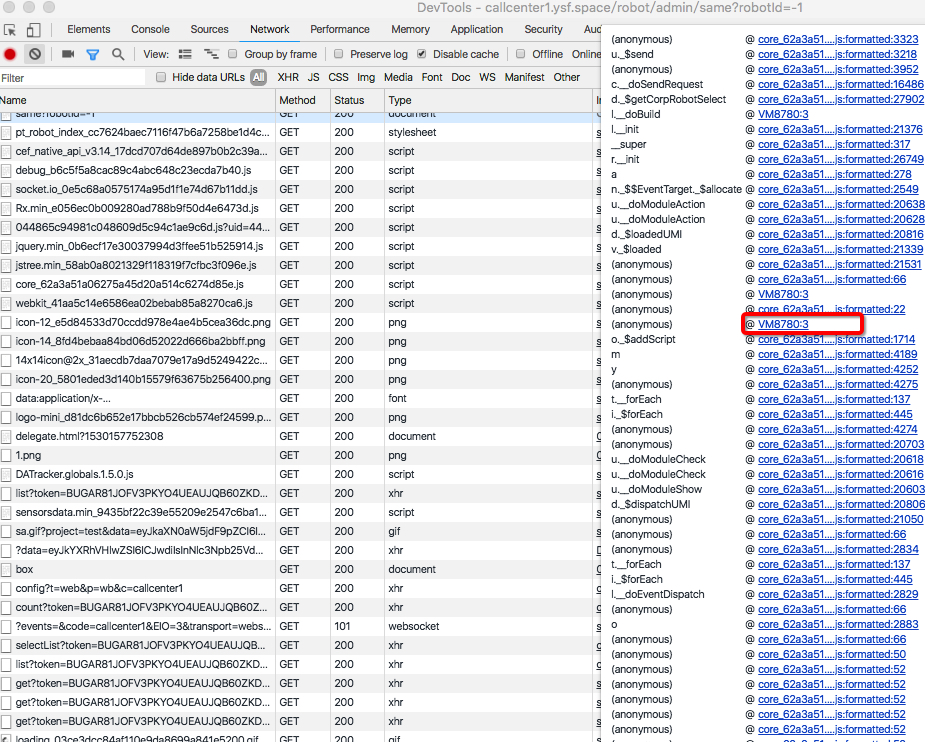

单击打开vm脚本格式化后可以打断点debug：

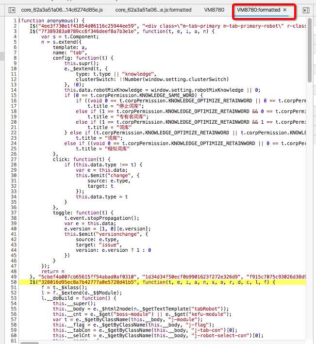

##### 精确定位到vm脚本

我们可以用Charles修改返回的报文，在期返回的FTL文件中加入console输出语句。例如我想定位下__onFocusIframe这个函数在线上的执行情况，但是被打在了FTL文件中

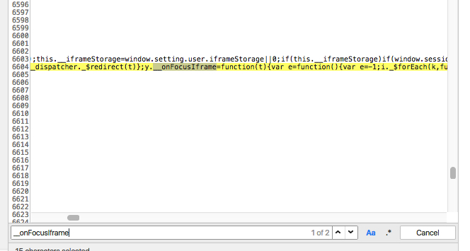

修改返回的这个文件，让它在__onFocusIframe函数中console.log(1),然后执行触发这个函数的操作，可以在显示台看见1的输出。

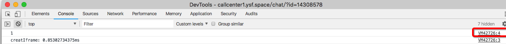

点击右侧的源码地址并且点击{}格式化一下，就可以看见具体在console上输出1的具体vm代码片段，继续在这个函数或者文件中加一个断点就可以调试具体代码的行为了。

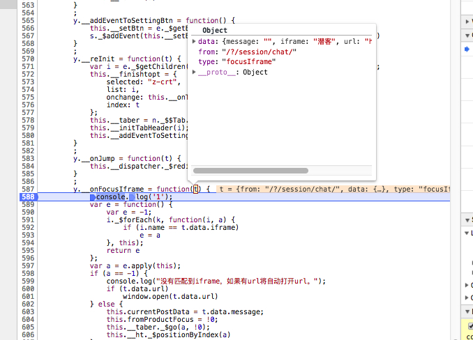

